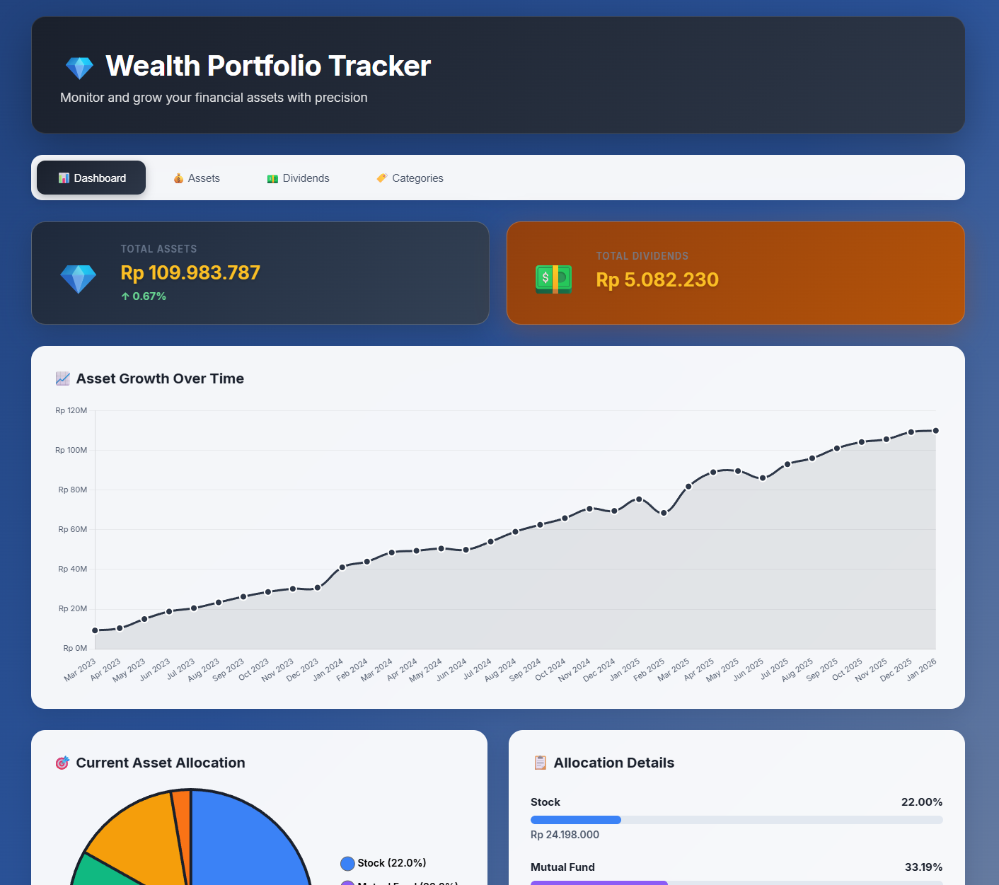
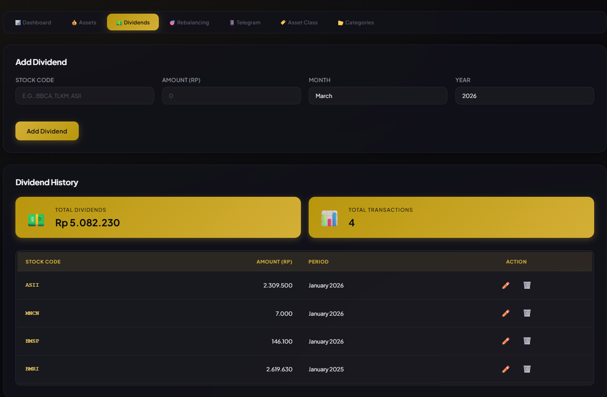
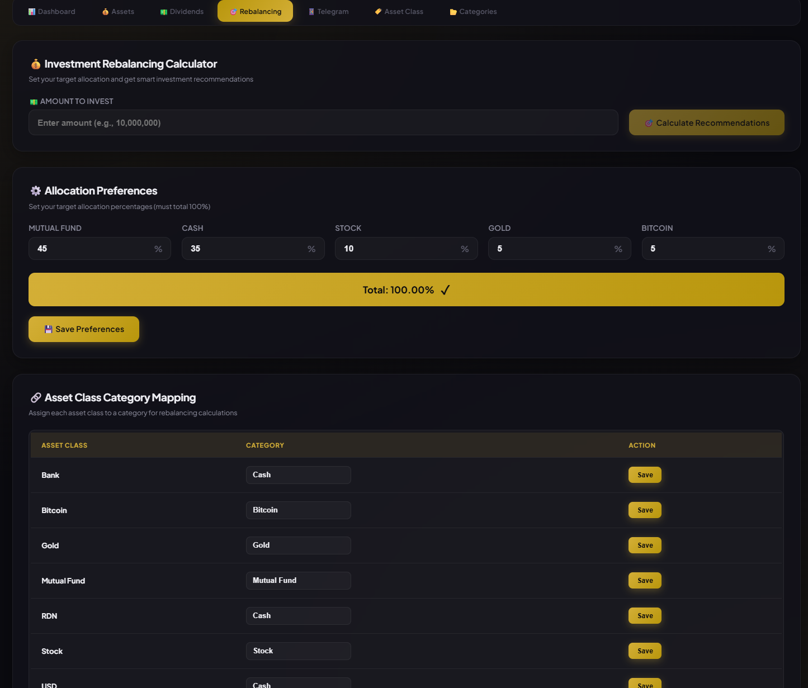

# 💎 Wealth Portfolio Tracker

A comprehensive personal financial asset tracking application built with modern web technologies. Monitor and grow your financial assets with precision through intuitive visualizations and detailed analytics.



## ✨ Features

### 📊 Dashboard
- **Real-time Asset Overview** - View total assets and dividends at a glance
- **Interactive Pie Chart** - Visual representation of asset allocation by category
- **Growth Tracking** - Line chart showing asset growth over time
- **Allocation Details** - Detailed breakdown with percentages and amounts

### 💰 Asset Management
- **Monthly Asset Input** - Record asset values for each month
- **Multiple Asset Classes** - Support for stocks, mutual funds, crypto, gold, and more
- **Historical Data** - View and edit past monthly records
- **Growth Calculation** - Automatic percentage change calculation

### 💵 Dividend Tracking
- **Dividend Records** - Track dividend income from stocks
- **Monthly Breakdown** - Organize dividends by month and year
- **Total Calculation** - Automatic summation of dividend income

### 🏷️ Asset Categories
- **Dynamic Categories** - Add custom asset classes on the fly
- **Default Categories** - Pre-configured with common asset types
- **Flexible Management** - Edit and organize your asset categories

### 🎯 Investment Rebalancing
- **Smart Allocation Calculator** - Calculate optimal investment distribution based on target percentages
- **Target Allocation Settings** - Set and customize target allocation percentages for each asset category
- **Asset Class Mapping** - Map individual assets to broader categories (Cash, Mutual Fund, Stock, Gold, Bitcoin, Other)
- **Proportional Distribution** - Automatically distributes additional investment proportionally based on current gaps
- **Visual Recommendations** - Clear breakdown showing current amounts, target amounts, and suggested allocations
- **Real-time Calculations** - Instant recommendations as you input investment amounts

### � Telegram Integration
- **Automated Reports** - Send financial dashboard reports directly to Telegram
- **Manual Send** - Send reports on-demand to any Telegram chat
- **Auto-Scheduling** - Automatically send reports on the last day of each month at 23:00
- **Rich Formatting** - Reports include total assets, dividends, and allocation breakdown
- **Easy Setup** - Simple configuration with bot token and chat ID

### 🔒 Data Validation
- **Future Date Prevention** - Cannot input data for future months
- **Input Formatting** - Automatic number formatting with thousand separators
- **Data Integrity** - Validation to ensure accurate financial records

## 🖼️ Screenshots

### Dashboard View


### Dividend Tracker


### Rebalancing


## 🚀 Quick Start

### Prerequisites
- Docker
- Docker Compose

### Installation

1. **Clone the repository**
   ```bash
   git clone <repository-url>
   cd asset-allocation
   ```

2. **Start all services**
   ```bash
   docker-compose up -d
   ```

3. **Access the application**
   - Frontend: http://localhost:3000
   - Backend API: http://localhost:8082
   - Database: localhost:5432

### First Time Setup

The application will automatically:
- Create database tables
- Set up default asset classes
- Initialize the database schema

## 🏗️ Architecture

### Tech Stack

**Frontend**
- Vue.js 3 - Progressive JavaScript framework
- Vite - Next generation frontend tooling
- Chart.js - Beautiful charts and graphs
- Axios - HTTP client

**Backend**
- Rust - Systems programming language
- Actix-web - Powerful web framework
- SQLx - Async SQL toolkit
- PostgreSQL - Robust database

**Infrastructure**
- Docker - Containerization
- Docker Compose - Multi-container orchestration
- Nginx - Web server for frontend

### Service Architecture

```
┌─────────────────┐
│   Frontend      │
│   (Vue.js)      │ ← Port 3000
│   Nginx         │
└────────┬────────┘
         │
┌────────▼────────┐
│   Backend       │
│   (Rust)        │ ← Port 8082
│   Axum-web     │
└────────┬────────┘
         │
┌────────▼────────┐
│   Database      │
│   (PostgreSQL)  │ ← Port 5432
└─────────────────┘
```

## 📡 API Documentation

### Dashboard
- `GET /api/dashboard` - Get dashboard summary data

### Asset Classes
- `GET /api/asset-classes` - List all asset classes
- `POST /api/asset-classes` - Create new asset class
  ```json
  {
    "name": "Real Estate"
  }
  ```

### Asset Snapshots
- `GET /api/snapshots` - Get all asset snapshots
- `POST /api/snapshots/bulk` - Create monthly snapshot for all assets
  ```json
  {
    "snapshot_month": 2,
    "snapshot_year": 2026,
    "assets": {
      "Stock": 25000000,
      "Mutual Fund": 15000000
    }
  }
  ```
- `GET /api/history` - Get historical asset data with growth

### Dividends
- `GET /api/dividends` - List all dividend records
- `POST /api/dividends` - Add dividend record
  ```json
  {
    "stock_name": "BBCA",
    "amount": 500000,
    "received_month": 2,
    "received_year": 2026
  }
  ```
- `PUT /api/dividends/:id` - Update dividend record
- `DELETE /api/dividends/:id` - Delete dividend record

### Allocation Preferences
- `GET /api/allocation-preferences` - Get target allocation percentages
- `POST /api/allocation-preferences` - Update allocation preferences
  ```json
  [
    {
      "category_name": "Cash",
      "target_percentage": 20.0
    },
    {
      "category_name": "Mutual Fund",
      "target_percentage": 30.0
    },
    {
      "category_name": "Stock",
      "target_percentage": 25.0
    },
    {
      "category_name": "Gold",
      "target_percentage": 15.0
    },
    {
      "category_name": "Bitcoin",
      "target_percentage": 10.0
    }
  ]
  ```

### Asset Class Categories
- `GET /api/asset-class-categories` - Get asset class to category mappings
- `POST /api/asset-class-categories` - Update asset class category mapping
  ```json
  {
    "asset_class_id": 1,
    "category_name": "Stock"
  }
  ```

### Rebalancing
- `POST /api/rebalancing/calculate` - Calculate investment recommendations
  ```json
  {
    "additional_amount": 2000000
  }
  ```
  Response includes current total, target allocations, and suggested distribution of new investment.

### Telegram Settings
- `GET /api/telegram/settings` - Get Telegram configuration
- `POST /api/telegram/settings` - Update Telegram settings
  ```json
  {
    "bot_token": "your_bot_token_here",
    "chat_id": "your_chat_id",
    "is_enabled": true,
    "auto_send_enabled": true
  }
  ```
- `POST /api/telegram/send` - Send report to Telegram
  ```json
  {
    "chat_id": "target_chat_id"
  }
  ```

### Telegram Setup Guide

1. **Create a Telegram Bot**
   - Open Telegram and search for `@BotFather`
   - Send `/newbot` command
   - Follow instructions to create your bot
   - Copy the bot token provided

2. **Get Your Chat ID**
   - Start a chat with your bot
   - Search for `@userinfobot` on Telegram
   - Send any message to get your chat ID

3. **Configure in Application**
   - Go to Telegram tab in the application
   - Paste your bot token
   - Paste your chat ID
   - Enable Telegram integration
   - Optionally enable auto-send for monthly reports

4. **Test the Integration**
   - Click "Send Report Now" button
   - Check your Telegram for the financial report

## 🛠️ Development

### Project Structure

```
asset-allocation/
├── frontend/
│   ├── src/
│   │   ├── components/
│   │   │   ├── Dashboard.vue
│   │   │   ├── AssetManager.vue
│   │   │   ├── DividendTracker.vue
│   │   │   ├── AssetClassManager.vue
│   │   │   └── Rebalancing.vue
│   │   ├── App.vue
│   │   ├── main.js
│   │   └── style.css
│   ├── public/
│   │   └── favicon.svg
│   ├── Dockerfile
│   └── package.json
├── backend/
│   ├── src/
│   │   ├── main.rs
│   │   ├── handlers.rs
│   │   └── models.rs
│   ├── migrations/
│   │   ├── 001_init.sql
│   │   ├── 002_update_dividends.sql
│   │   └── 003_allocation_preferences.sql
│   ├── Dockerfile
│   └── Cargo.toml
└── docker-compose.yml
```

### Local Development

**Frontend Development**
```bash
cd frontend
npm install
npm run dev
```

**Backend Development**
```bash
cd backend
cargo run
```

### Environment Variables

**Backend**
- `DATABASE_URL` - PostgreSQL connection string
- `RUST_LOG` - Logging level (default: info)

## 🌐 Deployment

### Docker Compose (Recommended)
```bash
docker-compose up -d
```